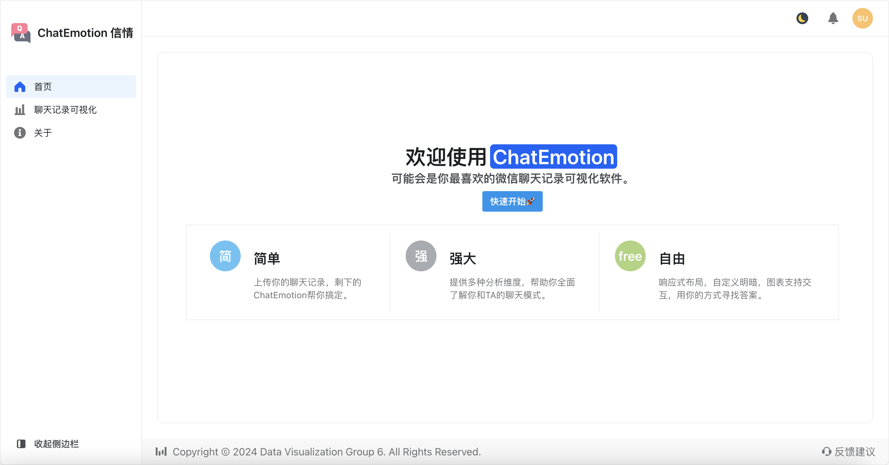
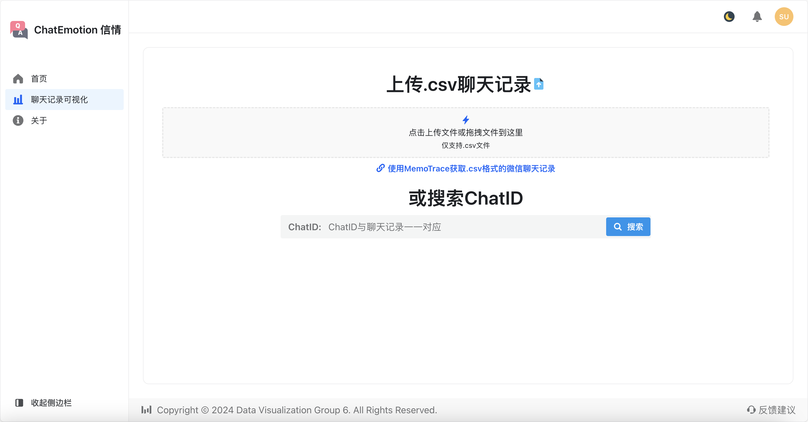
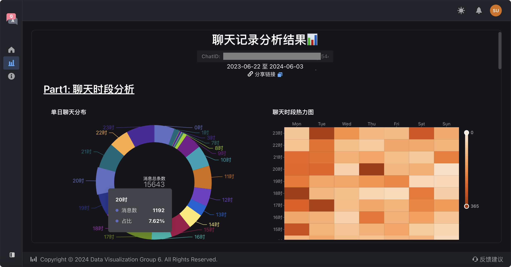
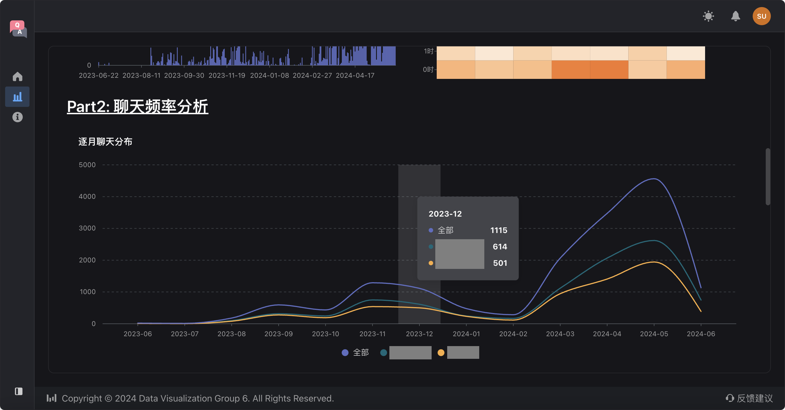
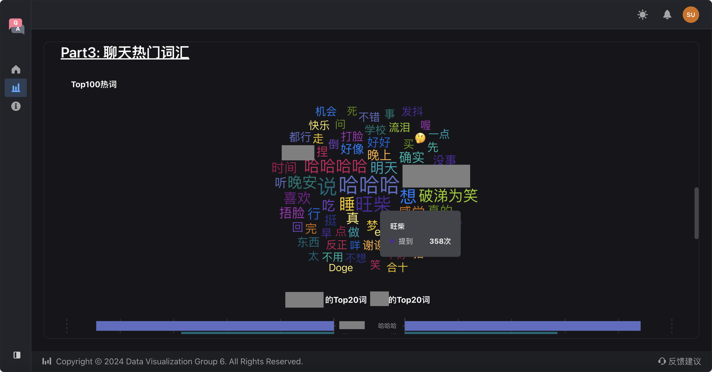
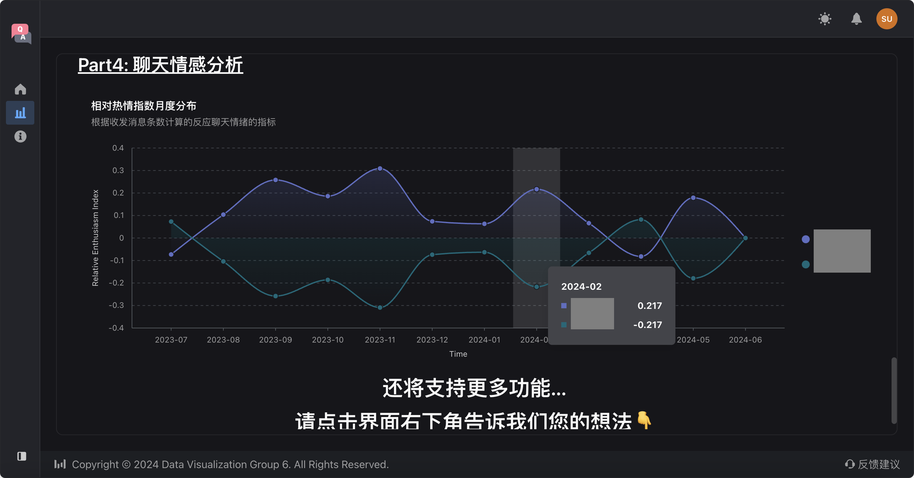

# ChatEmotion 信情
> 2024 BUAA Data Visualization teamwork
---

ChatEmotion is a WeChat history visualization tool.

**Next.js (React)** is the frontend framework.

Layouts are defined by **Semi-Design**. Charts are presented by **VChart**.

## download_packages
```
npm install
```

## run
```
npm run dev
```

## Presentation





